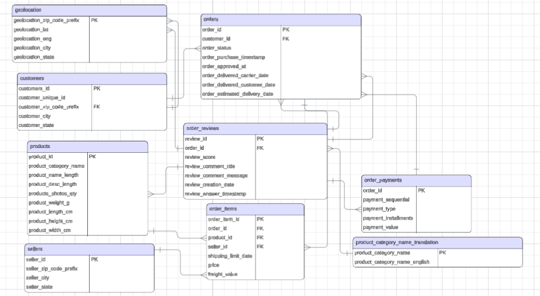

````markdown
# 🛒 Olist E-Commerce Solutions – Data Analysis Project

Olist is a Brazilian e-commerce company that connects small businesses to major online marketplaces.  
This project analyzes Olist’s e-commerce sales, customer behavior, and reviews using **PostgreSQL** and **Python**.  

The goal is to uncover insights about **order patterns, delivery performance, customer satisfaction, and product demand**.

---

## 📊 Entity Relationship Diagram (ERD)



---

## 🚀 Project Workflow

### 1. Set up PostgreSQL Database

1. Create a database:
   ```sql
   CREATE DATABASE ecommerce;
````

2. Import the provided CSV datasets into PostgreSQL:

   ```bash
   \copy table_name FROM 'dataset.csv' DELIMITER ',' CSV HEADER;
   ```
3. Run integrity and analytics queries:

   ```bash
   \i queries.sql
   ```

---

### 2. Run the Python Script

1. Install dependencies:

   ```bash
   pip install psycopg2 pandas
   ```
2. Execute the script:

   ```bash
   python main.py
   ```

   The script connects to PostgreSQL, runs sample queries, and prints results in the terminal.

---

### 3. 🔮 Future Tasks (Planned)

* Build an **analytics dashboard** with Apache Superset (or another visualization tool).
* Launch a **web interface** for interactive data exploration.

---

## 🛠 Tools & Resources

* **PostgreSQL** – database
* **Python** – `pandas`, `psycopg2`
* **GitHub** – version control
* **Apache Superset** (planned) – data visualization
* **Dataset** – Olist E-Commerce Public Dataset

---

## 📌 Project Objectives

* Analyze **sales trends** and **order patterns**
* Evaluate **delivery performance**
* Assess **customer satisfaction** through reviews
* Identify **product demand and behavior**
