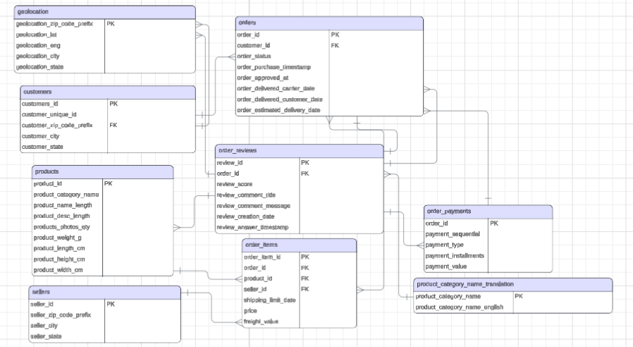

Olist E-Commerce Solutions – a Brazilian e-commerce company that connects small businesses to major online marketplaces.
**ERD:**

**Project description**

This project analyzes Olist’s e-commerce sales, customer behavior, and reviews using PostgreSQL and Python. The goal is to uncover insights about order patterns, delivery performance, customer satisfaction, and product demand.

1. Set up PostgreSQL database

Create a database named ecommerce.

Import the provided CSV datasets into PostgreSQL using the \copy command.

Run the queries.sql file to test data integrity and run analytics queries.

2. Run the Python script

Install dependencies:

pip install psycopg2 pandas

Execute the script:

python main.py

The script connects to PostgreSQL, runs sample queries, and prints results in the terminal.

3. Future tasks (for later assignments)

Start the analytics dashboard (Apache Superset or another visualization tool).

Launch the web interface for data exploration.

**Tools and Resources**

PostgreSQL (database)

Python (pandas, psycopg2)

GitHub (version control)

Apache Superset (planned visualization)

Dataset: Olist E-Commerce Public Dataset